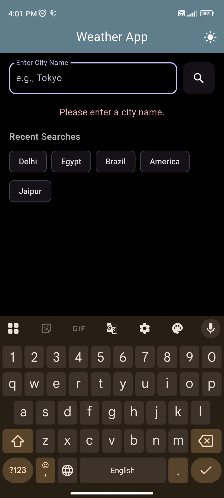
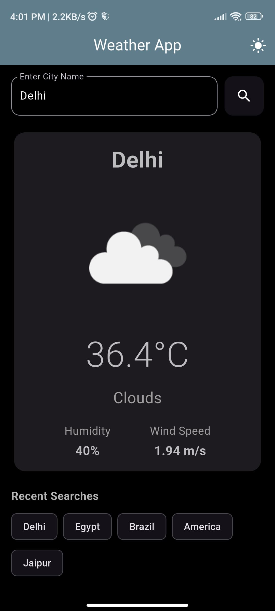
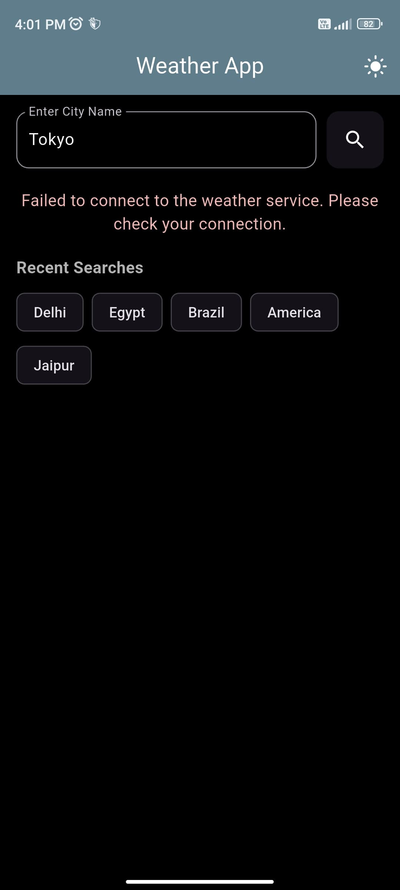

# Weather App

This is a simple Flutter application demonstrating a weather forecasting app using the `setState` approach for state management. It fetches current weather data for a given city from the OpenWeatherMap API and displays it in a clean, user-friendly interface. The app also features recent search history persistence using `shared_preferences` and a theme toggle (light/dark mode).

-----

## 📸 Screenshots


| Dark Mode (Main Screen) | Dark Mode (Weather Report) | Dark Mode (Error screen (No internet connection)) |
| :----------------------- | :---------------------- | :---------------------- |
|  |  | 

| Light Mode (Error/Empty) | Dark Mode (Recent Searches) |
| :----------------------- | :-------------------------- |
|  |  |

-----

## 🚀 Setup Instructions

Follow these steps to get the project up and running on your local machine.

### 1\. Prerequisites

Before you begin, ensure you have the following installed:

  * **Flutter SDK**: [Install Flutter](https://flutter.dev/docs/get-started/install)
  * **Dart SDK**: (Comes with Flutter)
  * **Code Editor**:
      * [VS Code](https://code.visualstudio.com/) with the Flutter extension, or
      * [Android Studio](https://developer.android.com/studio) with the Flutter and Dart plugins.

### 2\. Get an OpenWeatherMap API Key

This app relies on the OpenWeatherMap API to fetch weather data.

1.  **Sign up for an account**: Go to the [OpenWeatherMap website](https://openweathermap.org/api).
2.  **Generate an API key**: After signing up, navigate to the "API keys" tab in your profile. You'll find your default API key there, or you can create a new one. It might take a few minutes for the API key to become active.
3.  **Keep your API key handy** for the next step.

### 3\. Clone the Repository

Open your terminal or command prompt and clone the project:

```bash
git clone <repository_url>
cd weather_app
```

### 4\. Configure Your API Key

For security and flexibility, the API key is not directly hardcoded into the source but needs to be added via environment variables or a configuration file (for simplicity, we'll assume direct file modification for this example, but environment variables are recommended for production).

1.  Open the file: `lib/services/api_service.dart`

2.  Locate the line `static const String _apiKey = 'API_KEY_HERE';`

3.  Replace `'API_KEY_HERE'` with the actual API key you obtained from OpenWeatherMap.

    ```dart
    // lib/services/api_service.dart
    // ...
    static const String _apiKey = 'YOUR_ACTUAL_API_KEY_HERE'; // <--- Replace this!
    // ...
    ```

### 5\. Install Dependencies

Navigate to the project root directory in your terminal and run:

```bash
flutter pub get
```

This command fetches all the necessary packages (like `http` and `shared_preferences`) defined in `pubspec.yaml`.

### 6\. Run the Application

Connect a physical device or start an emulator/simulator. Then, run the app from your terminal:

```bash
flutter run
```

Alternatively, you can run it directly from your IDE (VS Code: `Run > Start Debugging` or Android Studio: `Run 'main.dart'`).

-----

## 🎯 Assumptions & TODOs

### Assumptions

  * **OpenWeatherMap API Key:** It's assumed you will obtain and provide a valid OpenWeatherMap API key. Without it, the weather fetching functionality will not work.
  * **Basic Network Connectivity:** The app assumes the device has an active internet connection to fetch weather data.
  * **City Name Input:** The app expects valid city names for accurate weather results. It performs basic empty string validation but doesn't validate against non-existent cities beyond what the API handles.

### TODOs

  * **Implement Location-Based Weather:** Add functionality to get weather based on the device's current GPS location. This would require permissions handling and a geo-location package.
  * **Add Unit Conversion:** Allow users to switch between Celsius and Fahrenheit.
  * **More Detailed Forecast:** Extend the app to show a 3-day or 5-day weather forecast.
  * **Search Suggestions/Autocomplete:** Implement a feature that provides city suggestions as the user types, improving UX.
  * **Error Handling Refinements:**
      * Provide more specific error messages for different API errors (e.g., "Invalid city name," "API key error," "Network unavailable").
      * Implement retry mechanisms for transient network issues.
  * **Improved UI/UX:**
      * Add animations for transitions or loading states.
      * Refine the `WeatherCard` design.
      * Implement pull-to-refresh for weather data.
  * **Advanced State Management:** Explore and implement the app using other state management solutions (e.g., Provider, Riverpod, BLoC) to compare their advantages over `setState` for larger applications.
  * **Testing:** Write unit, widget, and integration tests for various parts of the application (API service, weather model parsing, UI interactions).

-----

Feel free to contribute, open issues, or suggest improvements\!
